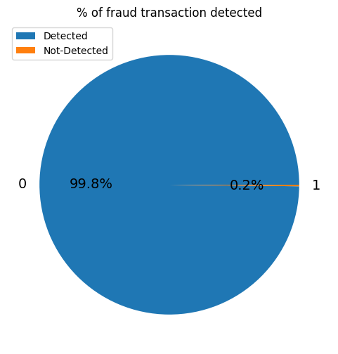

# Fraudlent-Transaction
In this project, we obtained fraudulent transactions from Kaggle, which contains over 150K+ transaction records and has seven features. We used multi-layer perceptron as a deep-learning model to train our model and TensorflowJs to deploy it to make a web app. We have obtained 99.8% accuracy in classifying fraudulent transactions, which is shown in the pie chart.

